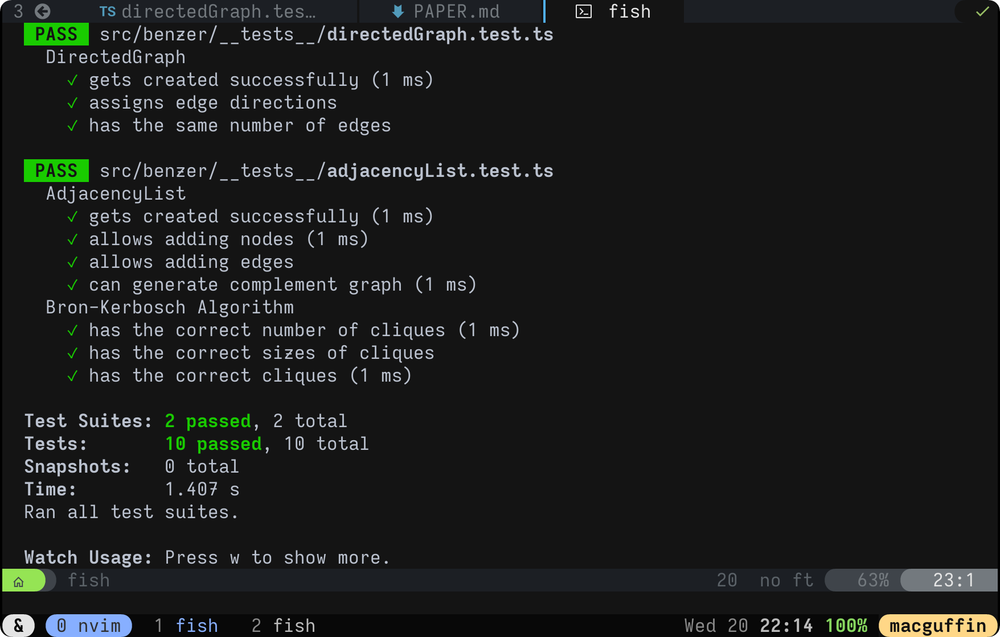

# JS Benzer

> Cooper b. Anderson<br>
> 2021-01-20

## Dev Log Update

&nbsp;&nbsp;&nbsp;&nbsp;&nbsp;&nbsp;&nbsp;&nbsp;
For a quick refresher, `js-benzer` is my recreation of the program Java Benzer,
created by John Jungck and colleagues. Since my last presentation, I have made
advancements towards the desired end result of a modernized version of Jungck's
program that can be ran on all recent operating systems by way of having the
front-end of the application be a webpage. This means that the application is
accessable from devices such as phones and tablets.

&nbsp;&nbsp;&nbsp;&nbsp;&nbsp;&nbsp;&nbsp;&nbsp;
I spent a great deal of my time for this part of the project doing research
into different automateable algorithms for performing the tasks involved in
Java Benzer; tasks such as finding maximal cliques, or transitively orienting
the complement of the graph. Since I had to make sure that my implementations
of these algorithms were successful, I decided to write decently sized test
suites from the beginning before I even began programming the implementations.
Here you can see the number of tests I created for two classes.

---
<div style="text-align:center">
	
</div>

---

&nbsp;&nbsp;&nbsp;&nbsp;&nbsp;&nbsp;&nbsp;&nbsp;
The algorithm listed under the `adjacencyList` suite, the Bron-Kerbosch
algorithm, is a "*much faster than brute force*" algorithm, but is still rather
slow compared to how efficient it could be, but we will get to that later.
Below is some pseudocode that describes the algorithm pretty vaguely, but it
gets the point across. One thing to note is that it uses `N(v)` to refer to the
children of node `v`.

```py
# R: empty set -- nodes confirmed in current clique
# P: set of all nodes -- nodes needed to be tested for the current clique
# X: empty set -- nodes confirmed to not be in the current clique

algorithm BronKerbosch(R, P, X) is
	if P and X are both empty then
		report R as a maximal clique
	for each vertex v in P do
		BronKerbosch(R ∪ {v}, P ∩ N(v), X ∩ N(v))
		P ← P \ {v}
		X ← X ∪ {v}
```

## Homework Problems

### Problem 1

Given the following matrix of overlapping DNA reads, use the Bron-Kerbosch
algorithm to list the maximal cliques. No credit given if no work is shown.

$
\text{The labels are as follows: }α, β, γ, δ, ε, θ \\
\text{} \\
\hspace{4em}
\begin{bmatrix}
1 & 0 & 1 & 1 & 1 & 1 \\
0 & 1 & 1 & 0 & 0 & 0 \\
1 & 1 & 1 & 1 & 0 & 1 \\
1 & 0 & 1 & 1 & 0 & 1 \\
1 & 0 & 0 & 0 & 1 & 0 \\
1 & 0 & 1 & 1 & 0 & 1 \\
\end{bmatrix}
$

### Problem 2

Earlier, I mentioned that the version of the Bron-Kerbosch algorithm that I
showed was slightly less efficient than it could be. This is because it makes
a recursive call for every clique, not necessarily every *maximal* clique. Your
job is to modify the existing algorithm so that it only makes a cursive call on
the maximal cliques. Here is something to get started:

```py
# R: empty set -- nodes confirmed in current clique
# P: set of all nodes -- nodes needed to be tested for the current clique
# X: empty set -- nodes confirmed to not be in the current clique

algorithm BronKerbosch(R, P, X) is
	if P and X are both empty then
		report R as a maximal clique
	choose a pivot vertex u in P ∪ X
	for ... (your turn)
```

## My Question

&nbsp;&nbsp;&nbsp;&nbsp;&nbsp;&nbsp;&nbsp;&nbsp;
How can these algorithms be applied to different areas of biology? Are there
uses for these efficient graph analysis procedures that extend beyond strictly
math and biology? I am sure that second question is true, but it is still an
interesting thing to think about. As of the time I am writing this, my program
does not yet do the full process of finding the simplified DNA sequence from
the overlap matrix, but I looking forward to continuing the progress on it so
that it surpasses my initial expectations. After the program is able to
complete the task for which it was created, I will look to find other areas
where it can I can apply the program to complete similar tasks, or even
completely unrelated tasks.

## Sources
 - https://github.com/cooper-anderson/js-benzer
 - https://en.wikipedia.org/wiki/Bron%E2%80%93Kerbosch_algorithm
 - https://en.wikipedia.org/wiki/Clique_problem

## Homework Answers

### Problem 1

The following are the maximal cliques: `{α, γ, δ, θ},  {α, γ, ε},  {β, γ, ε}`

### Problem 2

```py
# R: empty set -- nodes confirmed in current clique
# P: set of all nodes -- nodes needed to be tested for the current clique
# X: empty set -- nodes confirmed to not be in the current clique

algorithm BronKerbosch(R, P, X) is
	if P and X are both empty then
		report R as a maximal clique
	choose a pivot vertex u in P ∪ X
	for ... vertex v in P \ N(u) do
		BronKerbosch(R ∪ {v}, P ∩ N(v), X ∩ N(v))
		P ← P \ {v}
		X ← X ∪ {v}
```

